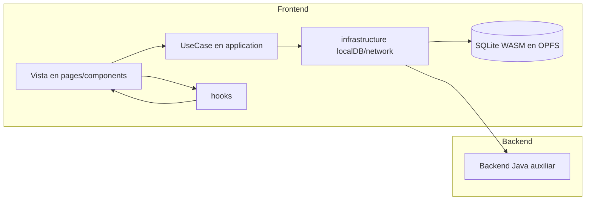
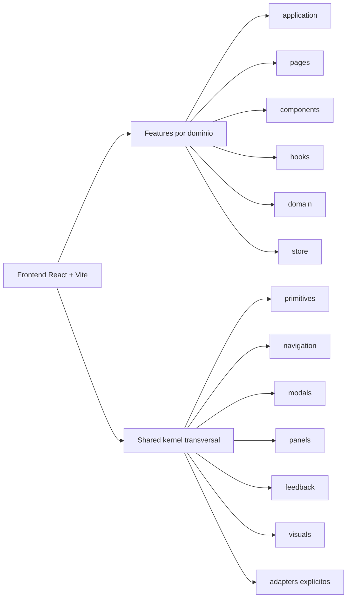

Chronos Atlas is built on a **hybrid local-first architecture** where the React/TypeScript frontend is the sovereign owner of all application data, and the Java auxiliary backend acts purely as an on-demand helper worker. This inversion of the traditional web model means the application is fully operational without any server connection — the backend exists to extend capability, not to enable it. Data lives in your browser's private filesystem. The server provides compute.

## The Two-Layer Stack

The responsibilities of each layer are strictly separated. Nothing that belongs in the frontend leaks into the backend, and the backend never holds authoritative application state.

| Concern | Frontend (React + Vite) | Backend (Java + Jetty) |
|---|---|---|
| **Runtime** | React 19, TypeScript 5.7, Vite 6 | Java 21, Spring Web MVC 5.3.31, embedded Jetty |
| **Data ownership** | All worldbuilding data — entities, maps, timelines, writing, linguistics | None; stateless between requests |
| **Persistence** | SQLite WASM (SQLocal) inside OPFS | Real filesystem via bridge endpoints |
| **State management** | Zustand stores, TanStack Query cache | N/A |
| **Offline capability** | Fully functional | Not applicable |
| **Typical tasks** | Rendering, editing, querying SQLite, graph operations | Filesystem backups, PDF/font export, filesystem-level snapshots |
| **Failure mode** | Frontend failure is isolated to the UI layer | If down, only heavy export features are disabled; all editing continues |

## Frontend Runtime Flow

When a user performs an action in the app — creating an entity, editing a timeline event, drawing a map region — the data flows through a strict layered pipeline entirely within the browser. No server round-trip is required.



The four stages of this pipeline are:

1. **View** (`pages/` and `components/`) — React components capture user input and render application state. They delegate all business logic to use cases and consume state through hooks.
2. **UseCase** (`application/`) — Orchestrates business operations without coupling to visual details. A use case coordinates domain rules and calls the infrastructure layer to persist or retrieve data.
3. **Infrastructure** (`src/infrastructure/`) — The only layer that knows how data is actually stored or fetched. It contains two sub-paths:
   - `localDB/` — SQLocal repositories that send SQL to a Web Worker executing SQLite WASM in OPFS.
   - `network/` — HTTP clients that communicate with the Java auxiliary backend when needed.
4. **SQLite WASM in OPFS** — The authoritative store. All writes are persisted as binary SQLite data in the browser's Origin Private File System.

<Warning>
  Components and hooks inside `features/` must **never** issue SQL queries directly. All data access must go through the repository layer at `src/infrastructure/localDB/repositories/`, imported via the `@repositories/*` alias. Bypassing this rule breaks the separation of concerns that makes the architecture maintainable and testable.
</Warning>

## Feature-Sliced Architecture

The frontend is organized as **vertical slices**, where each product domain — Entities, Maps, Timelines, Writing, Linguistics, Graph, Shell — is an independent feature that encapsulates all its own layers.



### Standard Folder Structure per Feature

Each feature lives under `src/features/<FeatureName>/` and may contain any of these directories as needed:

| Directory | Purpose |
|---|---|
| `application/` | Use cases and business orchestration logic. No UI imports. |
| `components/` | Visual components reusable within this feature only. |
| `hooks/` | Hooks shared across multiple components or pages within the feature. |
| `pages/` | Route-level views. Screen-specific hooks are co-located here, not in `hooks/`. |
| `domain/` | TypeScript types, interfaces, and domain contracts. |
| `store/` | Feature-scoped Zustand state. |

Not every feature requires every folder. Only create a directory when there are files that justify it.

The `index.ts` at the root of each feature is its **public API contract**. Other features must import from `@features/<FeatureName>` only — never from internal subdirectories like `@features/Entities/components/SomeComponent`.

### The Shared Kernel

`src/features/Shared/` is a **cross-cutting UI kernel** — not a business logic container. It provides primitives, navigation components, modals, panels, feedback widgets, and visual utilities that any feature may consume. Business-level integrations that must temporarily pass through Shared are declared explicitly in `Shared/adapters/` to remain visible and auditable.

## When the Backend Is Optional

A core design guarantee of Chronos Atlas is **graceful backend absence**. If the Java auxiliary server is not running or fails to start:

- Writing and editing prose in the Writing Hub continues normally.
- Creating, reading, updating, and deleting entities works without interruption.
- The Relationship Graph remains fully interactive — nodes and edges can be added, moved, and deleted.
- World Bible documents, timeline events, and map annotations are all readable and editable.
- Conlang/linguistics data remains accessible.

Only the following capabilities are blocked when the backend is unavailable:

- **Filesystem backup snapshots** — writing `.sqlite` copies to the real filesystem via the bridge endpoint.
- **Heavy export operations** — PDF generation (Flying Saucer) and any server-side compilation tasks.

This separation is intentional. The frontend must remain sovereign over data. The server is a worker, never a gatekeeper.

## Path Aliases

The frontend Vite configuration defines a set of path aliases that enforce clean import boundaries and insulate features from internal path changes. All imports inside `src/` should use these aliases rather than relative paths that cross layer or feature boundaries.

| Alias | Resolves To | Usage |
|---|---|---|
| `@features` | `src/features` | Root of the features directory |
| `@components` | `src/features/Shared` | Importing from the Shared kernel (e.g. `@components/primitives`) |
| `@context` | `src/features/App/context` | Application-level React contexts (active workspace, project ID, etc.) |
| `@database` | `src/infrastructure/localDB/client` | The SQLocal `sqlocal` instance and `sql` tag |
| `@infrastructure` | `src/infrastructure` | Full infrastructure layer root |
| `@repositories` | `src/infrastructure/localDB/repositories` | Repository service modules (`@repositories/entityService`, etc.) |
| `@network` | `src/infrastructure/network` | Network clients (`@network/syncService`, etc.) |
| `@utils` | `src/infrastructure/utils` | Shared utility functions |
| `@domain/database` | `src/features/App/domain/database` | Core domain types (`Entidad`, `Proyecto`, `Carpeta`, etc.) |
| `@domain/maps` | `src/features/Maps/domain/maps` | Map-specific domain types |
| `@domain/timeline` | `src/features/Timeline/domain/timeline` | Timeline domain types |
| `@domain/writing` | `src/features/Writing/domain/writing` | Writing/notebook domain types |
| `@domain/linguistics` | `src/features/Linguistics/domain/linguistics` | Linguistics/conlang domain types |
| `@domain/graph` | `src/features/Graph/domain/graph` | Graph domain types |
| `@domain/ui` | `src/features/Shell/domain/ui` | Shell/UI domain types |

<Note>
  Shared kernel imports use `@components` — there is no `ui` segment in the path. Importing `@components/ui/Button` is incorrect; the right form is `@components/primitives/Button` (or whichever Shared subdirectory applies). Individual `@domain/*` aliases are declared explicitly in `vite.config.ts` — there is no single catch-all `@domain/*` wildcard.
</Note>

### Architecture Guardrails

Two automated checks enforce these boundaries at any time during development:

```bash
# Non-breaking report — safe to run locally
npm run arch:check

# Strict mode — exits with error if violations are found (CI use)
npm run arch:check:strict
```

Both commands write results to `frontend/reports/architecture-guard-report.json`. The rules verified are:

1. **No deep cross-feature imports** — a feature must not import internal subdirectories of another feature.
2. **No business logic in Shared outside of `Shared/adapters`** — the Shared kernel must remain a pure UI utility layer.
