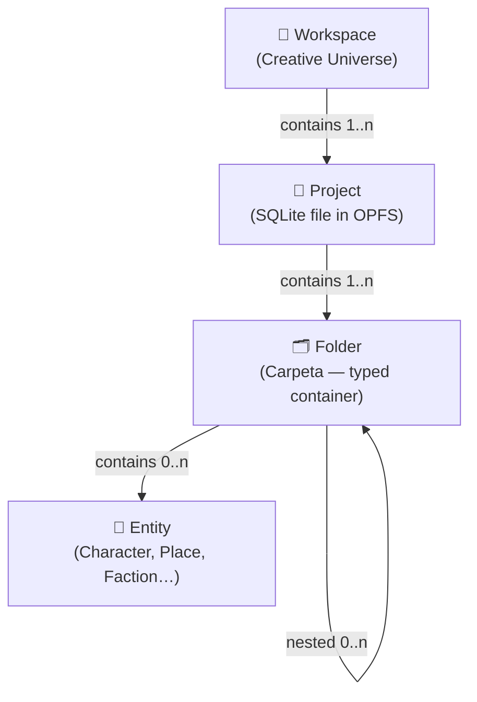

Chronos Atlas uses a two-level organizational structure to keep your creative work well-scoped and portable. At the top level, a **Workspace** represents a broad creative universe — a fantasy world, a book series, a tabletop campaign. Within each Workspace sit one or more **Projects**, each of which is a fully isolated SQLite database stored on your machine. This separation means that two projects in the same Workspace share no data by default, giving you clean boundaries between, say, a prequel novel and its sequel while keeping them logically grouped under one universe.

## Workspaces

A Workspace is the top-level container that groups related Projects together. Think of it as the name of your creative universe: *The Shattered Kingdoms*, *Campaign: Icebound*, or *The Meridian Trilogy*. It does not store content directly; instead it acts as a label and a navigation context that tells the application which set of Projects to show you.

When you open Chronos Atlas you land on the **WorkspaceSelector** page. Here you can see all your defined Workspaces and choose which one to enter. Selecting a Workspace sets the active `projectId` in the application state, which in turn determines what every sidebar module — World Bible, Timelines, Maps, Conlangs, and the rest — will display.

<Info>
  You can have as many Workspaces as you like. Each one is completely independent; switching Workspaces is like opening a different book from your shelf.
</Info>

## Projects

A Project is the concrete unit of storage in Chronos Atlas. All projects share a single SQLite database file (`worldbuilding_app.sqlite3`) persisted in the browser's Origin Private File System (OPFS). Projects are logically isolated from one another by their `project_id` foreign key — every table that stores worldbuilding content (entities, folders, events, and more) includes a `project_id` column, and all queries are filtered by the active project. When you create a Project, a new row is inserted into the `proyectos` table and the schema is confirmed to be up-to-date.

Projects are managed through the `WorkspaceUseCase` class in the application layer:

```typescript
// Create a new project
static async createProject(
  name: string,
  title: string,
  genre: string,
  imageUrl?: string,
): Promise<Proyecto>

// List all available projects
static async listProjects(): Promise<Proyecto[]>

// Update project metadata
static async updateProject(
  projectId: number,
  data: Partial<Proyecto>,
): Promise<void>

// Permanently delete a project and all its content (cascade)
static async deleteProject(projectId: number): Promise<void>
```

Every project is described by the `Proyecto` interface defined in `src/features/App/domain/database.ts`:

```typescript
export interface Proyecto {
  id: number;
  nombre: string;
  descripcion?: string;
  tag?: string;
  image_url?: string;
  initials?: string;
  fecha_creacion: string;
  ultima_modificacion: string;
}
```

<CardGroup cols={2}>
  <Card title="nombre" icon="tag">
    The unique identifier name for the project. Used internally to look up the database file.
  </Card>
  <Card title="tag" icon="bookmark">
    An optional short genre or category label (e.g. "Fantasy", "Sci-Fi") shown in the selector UI.
  </Card>
  <Card title="initials" icon="text">
    Auto-generated two-letter abbreviation from the project title, used as a visual avatar fallback.
  </Card>
  <Card title="ultima_modificacion" icon="clock">
    Automatically updated timestamp used to sort projects by most-recently-used in the selector.
  </Card>
</CardGroup>

## The `Carpeta` Interface

Every folder in Chronos Atlas is represented by the `Carpeta` interface, defined in `src/features/App/domain/database.ts`:

```typescript
export interface Carpeta {
  id: number;
  nombre: string;
  project_id: number;
  padre_id: number | null;
  tipo: FolderType;
  slug: string;
  borrado: number;
  itemCount?: number;
}
```

Key fields:

- **`padre_id`** — the parent folder's ID. `null` means the folder sits at the project root.
- **`tipo`** — determines which specialized module opens when you navigate into this folder (see `FolderType` below).
- **`borrado`** — soft-delete flag (`0` = active, `1` = trashed). Deleted folders are hidden from the sidebar but remain in the database.
- **`itemCount`** — optionally computed count of child entities; not persisted in the database.

## Folder Types

Inside each Project, content is organized into a tree of **Carpetas** (folders). Every folder has a `tipo` field that determines which specialized editor or viewer the application opens when you navigate into it. The `FolderType` union covers all folder variants supported by the current schema:

```typescript
export type FolderType =
  | "FOLDER"
  | "TIMELINE"
  | "DIMENSION"
  | "CONLANG"
  | "MAPS"
  | "ARCHIVE";
```

<Accordion title="FOLDER — General container">
  A plain organizational folder in the World Bible. Can hold entities (characters, places, factions, etc.) and other nested sub-folders. This is the default type for any manually created directory.
</Accordion>

<Accordion title="TIMELINE — Chronological axis">
  Opens the **Chronos Atlas** timeline editor. Folders of this type store `Evento` records that are rendered on a chronological axis. A single entity can be linked to multiple timeline folders via the `eventos_entidades` join table.
</Accordion>

<Accordion title="DIMENSION — Parallel branches">
  Activates the multiverse / parallel-line view. Folders of this type contain `DimensionLinea` records, each representing a parallel timeline branch that can be associated with a specific entity.
</Accordion>

<Accordion title="CONLANG — Constructed language">
  Opens the **Glyph Foundry** linguistics workbench. Folders of this type hold `Word` entities with dedicated fields for grammatical category, definition, glyph SVG data, and phonetic composition rules.
</Accordion>

<Accordion title="MAPS — Cartography">
  Activates the map viewer. Map image assets are stored on disk by the Java auxiliary backend rather than inside OPFS. See [Local-First Storage](/concepts/local-first-storage) for details.
</Accordion>

<Accordion title="ARCHIVE — Read-only storage">
  A soft-archived folder whose contents remain searchable but are visually de-emphasized in the sidebar tree. Useful for retired characters, deprecated lore, or finished chapters you want to keep for reference.
</Accordion>

## Navigation Flow

Selecting a Workspace on the home screen sets the active `projectId`. Every sidebar module then uses this ID as the root filter for all its database queries. The application never mixes data across projects — even if two projects are in the same Workspace, their entities, folders, and settings are completely isolated.



<Steps>
  <Step title="Choose a Workspace">
    On the WorkspaceSelector home screen, pick or create a Workspace. This sets the active context for the entire application session.
  </Step>
  <Step title="Open a Project">
    Select a Project within that Workspace. Chronos Atlas loads the corresponding SQLite database from OPFS and initializes the sidebar modules.
  </Step>
  <Step title="Navigate modules">
    Use the left sidebar to switch between World Bible, Timelines, Maps, and other specialized modules. All data shown is scoped to the active `projectId`.
  </Step>
  <Step title="Browse folders and entities">
    Expand the folder tree to drill down into specific areas of your world. Clicking a folder navigates to its typed editor; clicking an entity opens its detail form.
  </Step>
</Steps>
